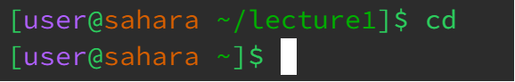
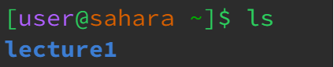
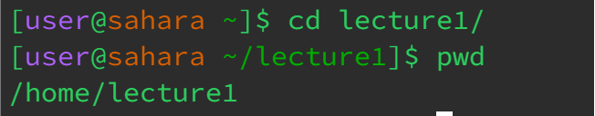

# **LR1 | Remote Access and FileSystem**

By Ren Sano

# **Command With NO Arguments**

*cd*

  
 > As we are currently in the lecture1 directory, calling 'cd' without any arguments automatically tells the terminal to change directories back home, indicating in the terminal's brackets.
---
*ls*

 
> By calling 'ls' without any arguments, it indicates to show what files are accessible on the current directory you're in, which this example we are in the /home directory.
---
*cat*

# **Command With Path to a Directory**

*cd*

  
> Calling 'cd lecture1/' calls the directory to change to lecture1, this is the argument input for the command cd.
---
*ls*

---
*cat*

# **Command With Path to a File**

*cd*

---
*ls*

---
*cat*

