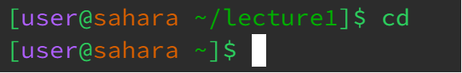
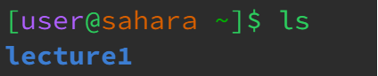
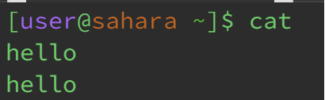
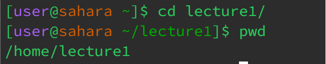
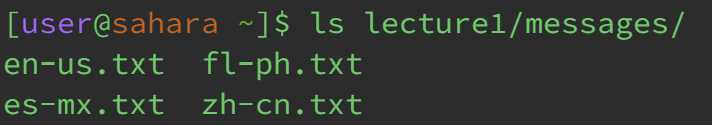

# **LR1 | Remote Access and FileSystem**

By Ren Sano

# **Command With NO Arguments**

*cd*

  
 > As we are currently in the lecture1 directory, calling 'cd' without any arguments automatically tells the terminal to change directories back home, indicating in the terminal's brackets.
---
*ls*

 
> By calling 'ls' without any arguments, it indicates to show what files are accessible on the current directory you're in, which this example we are in the /home directory.
---
*cat*

> By calling 'cat' in the terminal, it runs into an error as this command requires at least one or two inputs in the command line to concatenate. Though you could call existing files within the 'messages' directory to concatenate in this example, simply putting cat in the terminal does nothing. 

# **Command With Path to a Directory**

*cd*

  
> Calling 'cd lecture1/' calls the directory to change from home to lecture1, 'lecture1' being the argument input for the command cd.
---
*ls*

 
> This example we are in the lecture1 directory, and by calling 'ls messages' takes the input of the messages directory and commands the terminal to access this file and see the contents it withholds

---
*cat*

# **Command With Path to a File**

*cd*

---
*ls*

---
*cat*

