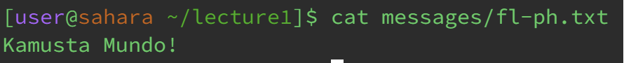
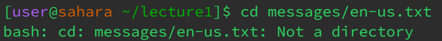
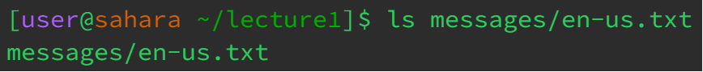
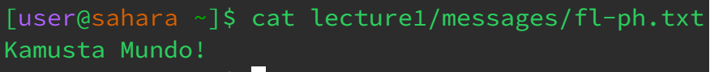

# **LR1 | Remote Access and FileSystem**

By Ren Sano

# **Command With NO Arguments**

*cd*

  
 > As we are currently working in the lecture1 directory, calling 'cd' without any arguments automatically tells the terminal to change directories back home, indicating in the terminal's brackets.

---
*ls*

 
> By calling 'ls' without any arguments, it indicates to show what files are accessible on the current directory you're in, which this example we are being shown what accessible files and directories are in the working /home directory.

---
*cat*

> By calling 'cat' in the terminal with no arguments, it waits for user input from the terminal as this command requires at least one or two inputs in the command line to concatenate. By typing a message into the terminal and pressing enter, it will return and display that input instead. If done nothing, it will return nothing and be left blank. 

# **Command With Path to a Directory**

*cd*

  
> Calling 'cd lecture1/' calls the directory to change from the working home directory, to lecture1, our argument input being 'lecture1' for the command cd.

---
*ls*

 
> This example we are working in the /home directory, and by calling 'ls lecture1/messages' takes the input of the first accessing the lecture1 directory, and then messages directory to command the terminal to access ahd display the files within the messages directory.

---
*cat*

  
> By working in the lecture1 directory, we can utilize 'messages/fl-ph.txt' as an input for the 'cat' command to quickly access the messages directory, and display the contents within the requested file, 'fl-ph.txt', onto the terminal.

# **Command With Path to a File**

*cd*

  
> Working in the lecture1 directory, we try to call the cd command to access the 'en-us.txt' file through the messages directory by using 'messages/en-us.txt' as the input arguement. This instead gives back an error due to the fact that the 'cd' command only changes to directories, not files such as text file 'txt'.

---
*ls*

  
> Also working in the lecture1 directory, we use the 'ls' command with the argument of 'messages/en-us.txt' to try and list any information about the en-us.txt. Because of this, the terminal returns with the path of which it takes to the directory, 'messages/en-us.txt'

---
*cat*

  
> Utilizing the 'cat' command as we're working in the home directory, inputting 'lecture1/messages/fl-ph.txt' instructs the terminal to access change to the messages directory to print the contets of the 'fl-ph.txt' file onto the terminal. This ends with the output "Kamusta Mundo!"

