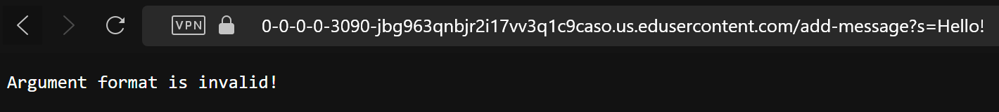

# **LR2 | Servers and SSH Keys**

By Ren Sano

# `Part 1` 
---
**Chat Server Code :**

```
import java.io.IOException;
import java.net.URI;
import java.util.ArrayList;

class Handler implements URLHandler {
    // The one bit of state on the server: a number that will be manipulated by
    // various requests.
   private ArrayList<String> messages = new ArrayList<>();

    public String handleRequest(URI url) {
        if (url.getPath().equals("/")) {
            return String.join("\n", messages); // joins lines
        } else {
        
        if (url.getPath().equals("/add-message")) {
            String[] parameters = url.getQuery().split("&"); //splits msg&user

            String user = "";
            String msg = "";

            for (String parameter : parameters) {
                String[] text = parameter.split("="); // takes msg&user string
                if (text.length == 2) {
                    if (text[0].equals("s")) {
                        msg = text[1];
                    } else if (text[0].equals("user")) {
                        user = text[1];
                    }
                }
            }
            if (!user.isEmpty() && !msg.isEmpty()) { 
                String newMessage = String.format("%s: %s", user, msg);
                messages.add(newMessage);
                return newMessage;
            } else {
                return "Argument format is invalid!"; // invalid arg
            }
        } else {
            return "404 Not Found!"; // what r u tryna do bruv
        }
    }

    }
}         

class ChatServer {
    public static void main(String[] args) throws IOException {
        if(args.length == 0){
            System.out.println("Missing port number! Try any number between 1024 to 49151");
            return;
        }

        int port = Integer.parseInt(args[0]);

        ServerEngine.start(port, new Handler());
    }
}    
```
# `Part 2` 
---
**Utilizing /add-message**

  
* In this example, the `handleRequest` and `main` methods are being called as the input taken from the website's url and runs through several commands to format the user and message. Then, the main method requests the output of the `handleRequest` method and returns with one of the return outcomes from the code.
* The relevant argument for these methods is the `URI` class, which takes HTTP requests, following whatever path the url is changed into. In this example, we utilize the `/add-message` path, which is a URI url input. It expects two String arguments divided by an `&` symbol, representing the message and the user. With another set of parameters, the code identifies the inputs after `s=` and `user=` as the message and username. These specific arguments within the `/add-message` path take the String values, `:3` and `ren`, and put it into one organized message in the format of `<user>: <message>`.
* The field that changes the most depending on the value inputs is the `private List<String> messages` field. As this example passes all of the arguments within the `handleRequest`, it will input the formatted values of the `message` and `user` into the `messages` List. When calling the empty path `/`, it will display all the previous messages sent in the exact format, line by line.

---
  
* In this *other* example, the `handleRequest` and `main` methods are still being called as there's at least still one input being the input that's taken as an argument in the `handleRequest` method.
* Because there *is* only one argument, this doesn't pass all of the method's parameters in the `/add-message` path, as it only has the message input after `s=`, but no `&` query and `user=` and username input. Because the argument needed in the `URI` class is two string arguments, the return outcome of the code when the main method calls this url request is, `Argument format is invalid!`.
* The `private List<String> messages` field did not change as this example did not successfully pass all the needed arguments in the `/add-message` path. This request of `/add-message?s=Hello!` is an unfulfilled request as the code doesn't fulfill the user argument that determines the name of the user, not adding a new String into the `messages` List.

**Private and Public Keys**
---
## `Private Key on Local Computer`
  
## `Public Key on Ieng6 Server`
  
## `Logging in W/O Password on Local Computer`
  

# `Part 3` 
---
**Reflection**

From the past labs in week 2 and 3, I've learned completely new concepts that I haven't know before such as how to utilize markdown and GitHub as an efficient way to document my code. Specifically in coding, I've also have gained a deeper understanding of terminals and how to use them in practical use in terms of web development and nagivating through private and local spaces.
