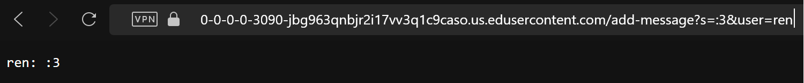

# **LR2 | Servers and SSH Keys**

By Ren Sano

# `Part 1` 
---
**Chat Server Code :**

```
import java.io.IOException;
import java.net.URI;
import java.util.ArrayList;

class Handler implements URLHandler {
    // The one bit of state on the server: a number that will be manipulated by
    // various requests.
   private ArrayList<String> messages = new ArrayList<>();

    public String handleRequest(URI url) {
        if (url.getPath().equals("/")) {
            return String.join("\n", messages); // joins lines
        } else {
        
        if (url.getPath().equals("/add-message")) {
            String[] parameters = url.getQuery().split("&"); //splits msg&user

            String user = "";
            String msg = "";

            for (String parameter : parameters) {
                String[] text = parameter.split("="); // takes msg&user string
                if (text.length == 2) {
                    if (text[0].equals("s")) {
                        msg = text[1];
                    } else if (text[0].equals("user")) {
                        user = text[1];
                    }
                }
            }
            if (!user.isEmpty() && !msg.isEmpty()) { 
                String newMessage = String.format("%s: %s", user, msg);
                messages.add(newMessage);
                return newMessage;
            } else {
                return "Argument format is invalid!"; // invalid arg
            }
        } else {
            return "404 Not Found!"; // what r u tryna do bruv
        }
    }

    }
}         

class ChatServer {
    public static void main(String[] args) throws IOException {
        if(args.length == 0){
            System.out.println("Missing port number! Try any number between 1024 to 49151");
            return;
        }

        int port = Integer.parseInt(args[0]);

        ServerEngine.start(port, new Handler());
    }
}    
```

**Utilizing /add-message**
---
  
* In this example, the `handleRequest` and `main` methods are being called as the input taken from the website's url and runs through several commands to format the user and message. Then, the main method requests the output of the `handleRequest` method and returns with one of the return outcomes from the code.
* The relevant arguments for these methods is the `URI` class, which takes HTTP requests, following whatever path the url is changed into if existing. In this example we utilize the `/add-message` path, which then expects two more arguments divided by an `&` symbol, representing the message and the user. With another set of parameters, the code identifies the inputs after `s=` and `user=` as the message and username. These specific arguments within the `/add-message` path take the user input, `:3` and `ren`, and put it into one organized message in the format of `<user>: <message>`.
* The value that tends to change the most depending on the outcome request is the `private List<String> messages` variable. As this example passes all of the arguments within the `handleRequest`, it will input the formatted data into the `messages` List. When calling the empty path `/`, it will display all the previous messages sent in the exact format, line by line.

---
  
* In this *other* example, the `handleRequest` and `main` methods are still being called as there's at least still one input being the input that's taken as an argument in the `handleRequest` method. Because there *is* only one argument, this doesn't pass all of the method's parameters, as it only has the message input after `s=`, but no `user=` and username input after including the `&` query. Because of this, the return outcome when the main method calls this url request is `Argument format is invalid!`.
* T

