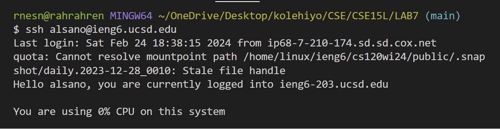
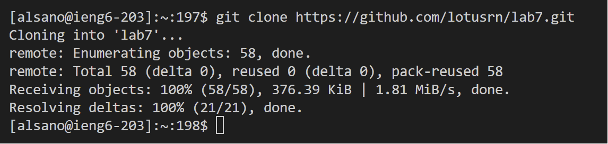

# **LR4 | VIM**

By Ren Sano

# `Traversing Through VIM` 

> Step 4

- I first login into my account on the `git bash` terminal by typing `ssh alsano@ieng6.ucsd.edu` + `EN`
- This permits me to log-in into my remote `ieng6` account

> Step 5

- Going on my GitHub website, I go to my forked repository and go to `<> CODE`,
  the `SSH` tab, and the icon to copy the link to my keyboard
- On my terminal I typed `<git clone>` and `CTRL+V`, then `<ENTER>`

> Step 6

[IMAGE]

- The I used the up arrow nine times to retrieve the `javac -cp .:lib/hamcrest-core-1.3.jar:lib/junit-4.13.2.jar *.java` command in the search history.
- This returned the `org.junit.runners.model.TestTimedOutException:` error in the second test
