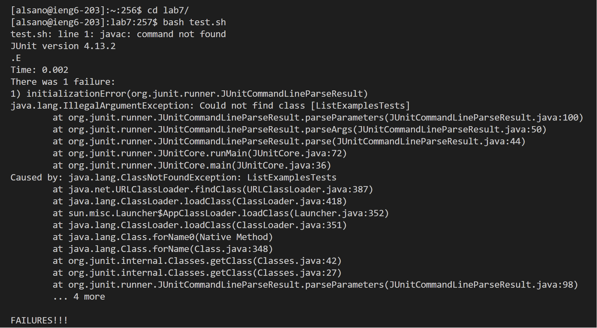
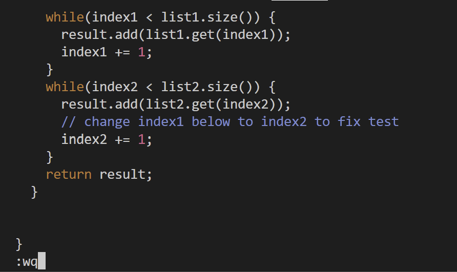
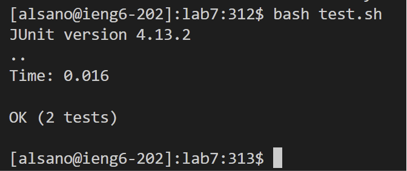
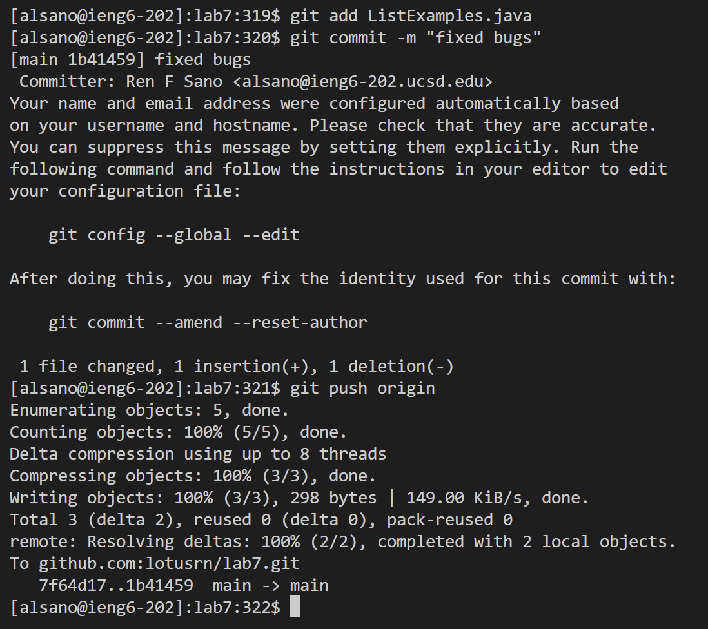

# **LR4 | VIM**

By Ren Sano

# `Traversing Through VIM` 

> Step 4

- I first login into my account on the `<git bash>` terminal by typing `<ssh alsano@ieng6.ucsd.edu>` + `<ENTER>`
- This permits me to log-in into my remote `ieng6` account

> Step 5

- Going on my GitHub website, I go to my forked repository and go to `<> CODE`,
  the `SSH` tab, and the icon to copy the link to my keyboard
- On my terminal I typed `<git clone>` and `<CTRL+V>`, then `<ENTER>`

> Step 6

- Then, I ran the `<bash test.sh>` to check if all the test cases pass.
- This returned the `org.junit.runner.JUnitCommandLineParseResult` and `java.lang.IllegalArgumentException` error in the second test

> Step 7

- To fix this, we edit the `ListExamples.java` by entering `<vim ListExamples.java>` into the terminal
- Our first fix is the `sc` parameter of `filter`, I pressed `<13j>` to traverse 23 lines down to the line of error and I typed `<19l>` to position the cursor to be before `checker` 
- I pressed `<i>` to enter `INSERT MODE`, and typed `<e><r>`
- I pressed `<ESC>` to move to the next line of error. In `NORMAL MODE` I typed `<30j>` to move 30 lines down to the start of the line. Then, I pressed `<h><h><h><h><h>`
- Entering `INSERT MODE` again with `<i>`, I typed `<BACSPACE>` + `<2>` + `ESC`
- To finish editing this `.java` file, I typed `<:wq>`

> Step 8

- I went back on my terminal history four up arrows to retrieve, `bash test.sh` + `<ENTER>`
- This returns all tests passing when they're reran

> Step 9

- To save these changes, we type `<git add>` + `<ListExamples.java>`
- `<git commit -m>` + `<"fixed bugs>` + `<ENTER>`, then to push onto GitHub, `<git push origin>` + `<ENTER>`
