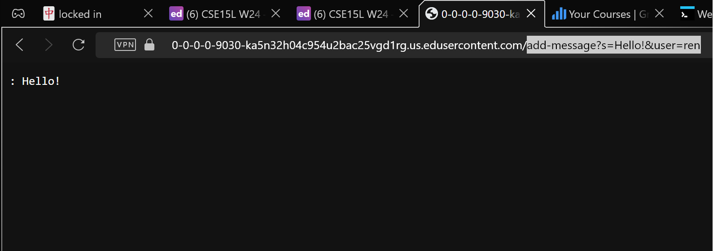
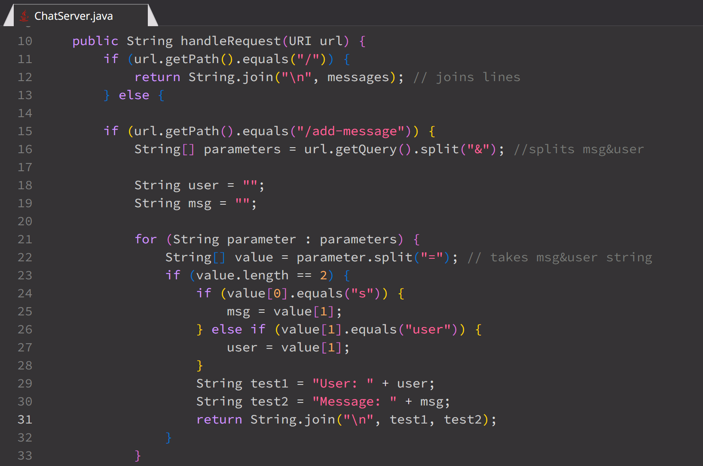
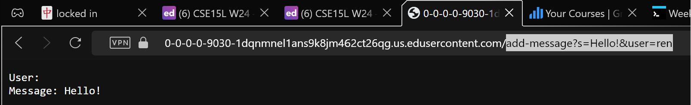

# **LR5 | Putting it All Together**

By Ren Sano

# `Debugging Scenario` 

- In this scenario, we are debugging the ChatServer from Week 2

> ## Lab Report 2 User and Message Bug
> 
> **Anonymous Badger**
> 
> Hello! I'm working on the code for Lab Report 2, but it seems my code implementation for dividing the `User` and `Message` is wrong. Whenever I try to add a message using the `add-message?s=<MESSAGE>&user=<NAME>` endpoint, it only returns the message. Below is a screenshot of the output when I try to add a message.
> 
> 

---
# 1 ANSWER

> **Silly TA**
> 
> Hi there,
>
> Looking at the photo, you might've misunderstood on how to separate the `<user>` and `<message>` inputs when coding the URL parameters. We might need more information about your code to help out with the issue, but please first try understanding what inputs are being properly retrieved by printing them out, then work from there on what arguments might've been parsed incorrectly. Any screenshots or copy/pastes of the terminal will be extremely helpful.

> **Anonymous Badger**
>
> Yes of course. Here's my updated URL Path code and what happens when I try to print out the user and message by itself.
> 
> 
> 
> 
> I'm still lost on what number arguement I'm supposed to retrieve once I split the use and message.

> **Silly TA**
>
> Thank you for providing the updated code. You're on the right track when parsing the `s=` and `user=` parameters, but let's take a closer look on what values you're taking.
> 
> When splitting the URL parameters using `String[] parameters = url.getQuery().split("&");`, each parameter should be split into key-value pairs separated by the equals sign (=). For example, for the URL `add-message?s=Hello!&user=ren`, the array parameters would contain two elements: `s=Hello!` and `user=ren`.
> 
> Next, when splitting each parameter further using `String[] value = parameter.split("=");`, the resulting array value would contain two elements: the key (e.g., s or user) and the corresponding value.
> 
> In your code, you correctly identify the value associated with the key `user` using `value[0].equals("user")`, which retrieves the user input. However, there's an issue with how you're retrieving the message input.
>
> In the line `msg = value[1];`, you're attempting to retrieve the message input. However, since the message parameter key is `s`, you should be checking for `s` instead of `user` in the conditional statement. Look carefully on what value arguments need ot be changed to retrieve the `s`. Let me know if you have any mroe questions!

---

- In this scenario, we need:

```
cse15l-lab-reports/
│
├── ChatServer/
   ├── ChatServer.java
   ├── Handler.java
```


- Contents *BEFORE* fixing the bug
  
```
import java.io.IOException;
import java.net.URI;
import java.util.ArrayList;

class Handler implements URLHandler {
    // The one bit of state on the server: a number that will be manipulated by
    // various requests.
   private ArrayList<String> messages = new ArrayList<>();

    public String handleRequest(URI url) {
        String user = "";
        String msg = "";

        if (url.getPath().equals("/")) {
            return "Recent Messages : " + messages;
        } else {
            if (url.getPath().contains("/add-message")) {
                String[] parameters = url.getQuery().split("&");
            
            for (String parameter : parameters) {
                String[] value = parameter.split("=");
                if (value.length == 2){
                    if (value[0].equals("s")) {  
                        msg = value[1];           
                    } else if (value[0].equals("user")){
                        user = value[1];
                    }
                    String newMessage = String.format("%s: %s", user, msg);
                    messages.add(newMessage);
                    //return String.join("\n", messages);
                }
                
            }
          }
        } return "404 Not Found!";
    }
}

class ChatServer {
    public static void main(String[] args) throws IOException {
        if(args.length == 0){
            System.out.println("Missing port number! Try any number between 1024 to 49151");
            return;
        }

        int port = Integer.parseInt(args[0]);

        ServerEngine.start(port, new Handler());
    }
}
```


- Command to Trigger the Bug
  
```
curl "http://localhost:8080/add-message?s=Hello!&user=ren"
```


- Fixing the Bug
- To fix the bug, you need to correct the conditional statement that checks for the message input key in the URL parameters. Currently, the code incorrectly checks for "s" instead of "user".

  
- Incorrect Lines

```
} else if (value[1].equals("user")) {           
   user = value[1];
}
```


- Fixed Lines
  
```
} else if (value[0].equals("user")) {        
   user = value[1];
}
```


# `Reflection`

This course has taught me the most about the application of coding in the real world, as well as very easy introductions about specific coding concepts that I look forward into seeing if I ever end up in that field. The use of BASH shortcuts, JDB, and VIM have been crucial for me to understand and grasp a sense of muscle memory to utilize, and I realized how useful it could be so efficient when we practiced with large data bases like Blue Sky. During lab, it was really useful to spend time with other peers and yourself to take time to practice. I was able to really apply what Politz wanted us to learn, and that was muscle memory. My ability to traverse through the terminal, even if I forget so many shortcuts, has significantly improved and I can confidently say that I can understand what's going on in the terminal when it comes to errors and failed test cases. The biggest thing that I got out of this course was the ability to think outside the box when it comes to coding. Using tools to amplify these ideas and ways to understnad debugging was really enjoyable and I felt constantly engaged in lecture and lab to always seek out the most in understanding bugs, servers, and databases. 
